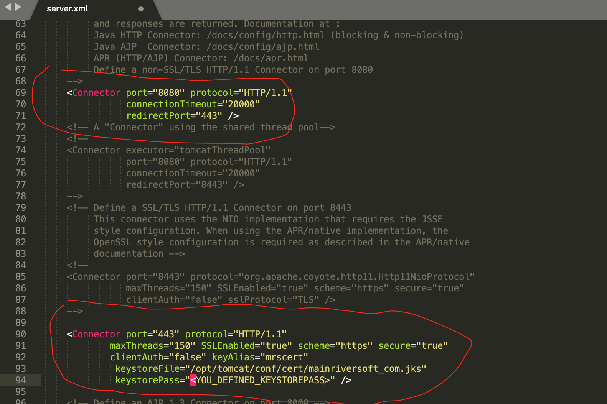
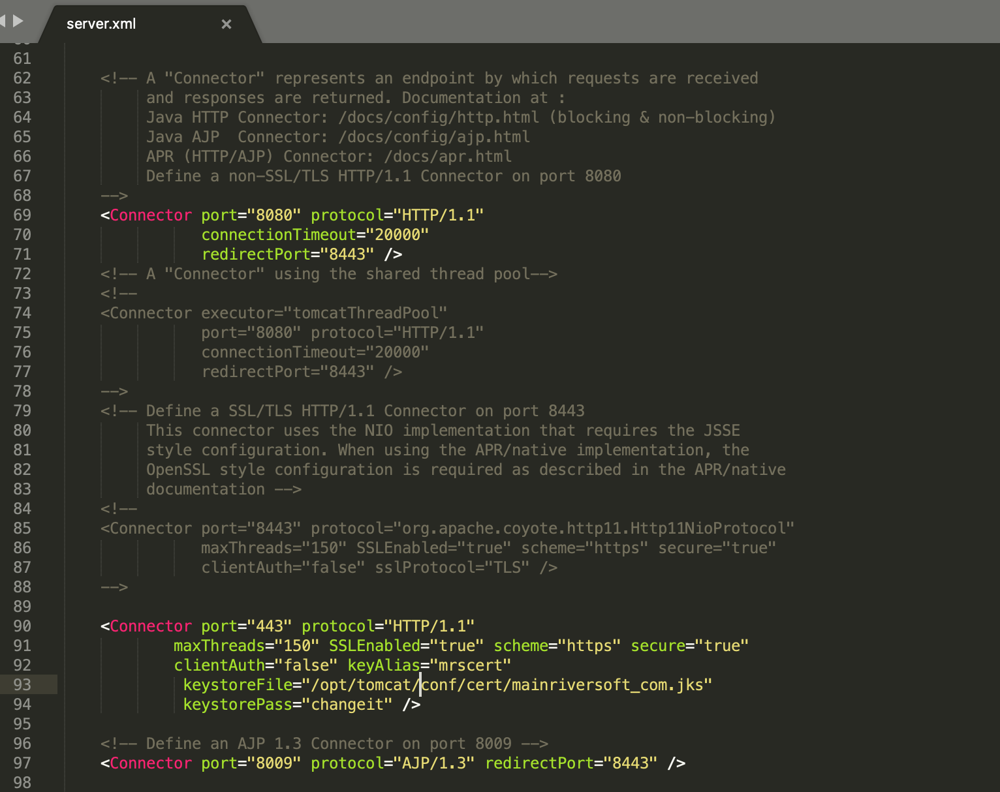

####  How to Install SSL certificate for your website 

This article uses tomcat as web server,  and mainriversoft.com as  domain to explain how to install certificate for your website

- Get SSL certificate for your domain 

  There are SSL certificate providers , just google ssl certificate + domain, then follow instruction you will be able to buy valid certificate  for your domain
  
  

- Assume you got valid certificate files for your doamin  (I got them from https://www.ssls.com/)

  mainriversoft_com.crt   -> server certificate

  mainriversoft_com_key.txt  -> private key 

  mainriversoft_com.ca-bundle  -> Root & Intermediate Certificate Bundle

  If you have root and intermediate certificate as seperate files instead of one bundle, you could join them as one bundle file, click the [link]( https://support.comodo.com/index.php?/Knowledgebase/Article/View/1145/1/how-do-i-make-my-own-bundle-file-from-crt-files) for details
  
  

- You generate/export the keystore file by below command,  need to provide keystorepass which will be used by server.xml configuration later on

  `openssl pkcs12 -export -in mainriversoft_com.crt -inkey mainriversoft_com_key.txt -certfile mainriversoft_com.ca-bundle -name mrscert -out mainriversoft_com.p12`

  alias name of server certificate is mrscert

  keystore file is mainriversoft_com.p12

- install keystore into tomcat 

  - stop tomcat on ubuntu linux 
  
    `systemctl stop tomcat`

  - modify tomcat/config/server.xml to setup keystore for tomcat 
  
     

  - modify tomcat/config/web.xml for redirect http to https         
  
     
  
  - start tomcat on ubuntu linux
  
     `systemctl start tomcat`

- As you can see, it works!

    

